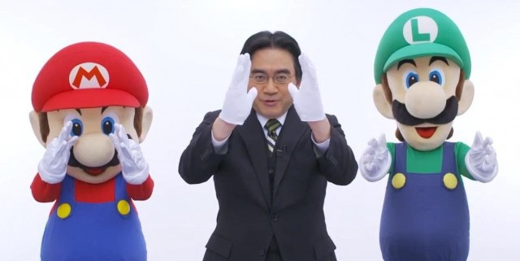
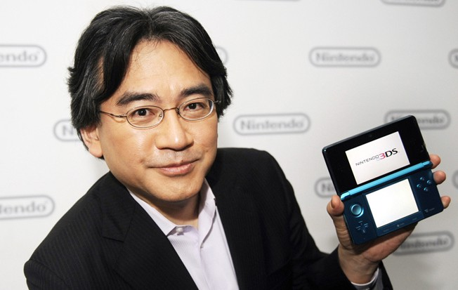

Es complicado escribir un buen texto cuando algo te afecta de tal forma como me ha afectado enterarme de que Satoru Iwata nos dejó el pasado sábado 11 de Julio. Esta mañana he pasado por las 5 fases del duelo bastante rápido, he estado un par de minutos negando lo ocurrido hasta que he podido leer la noticia en varios medios generalistas del sector. Depués he saltado directamente al dolor emocional. Y sigo ahí un poco, mezclándolo con la aceptación.

Creo que cualquiera de nosotros cuando piensa en Iwata no piensa en un presidente de una empresa que estaba ahí, mandando y cumpliendo los deseos de la junta de accionistas. Él mismo se describe en su famosa frase como desarrollador y jugador antes que como ejecutivo, y seguro ahí radica el amor que le profesábamos
Yo le recordaré como el adorable señor que presentaba las direct y hacía chistes sobre patearle el culo a Reggie. Su particular acento hablando inglés y sus formas siempre estarán presentes cada vez que vea una presentación de Nintendo. No puedo imaginarme a nadie más dándonos las noticias nintenderás más frescas directly to you
Lo mejor es que eso una pequeñísima parte de lo que era, antes de su muerte ya se comentaba que era un maldito genio del software. Adaptando los combates pokémon de Gameboy a N64 sin documentación, reescribiendo desde cero el código de Earthbound y comprimiendo el código de Pokémo Plata/Oro hasta tal punto que pudieron incluir la región de Kanto. Además de esos hitos también desarrolló jueguicos en Hal Laboratory para NES, SNES, Gameboy y Nintendo 64, entre los que destacan Balloon Fight, Kirby’s Dream land y el primer Super Smash bros, además del ya nombrado Earthbound.
Por no hablar del éxito que tuvo al acercar los vídeojuegos al público casual con NDS y Wii, una visión que no todos tuvieron y que no todos podrían haber llevado a cabo.

Sin embargo, quiero volver a lo de antes, pues creo que no hay presidente de una compañía que quiera dedicar tiempo a ponerse delante de una cámara a grabar una presentación cada pocos meses para enseñar a sus fans las novedades y avances en sus jueguicos. Creo que para eso hay que tener algo más que ganas y ahínco, hay que amar lo que haces. Esta es la idea principal que quería reflejar en este pequeño texto escrito por un fan cualquiera, creo que Satoru Iwata amaba lo que hacía por encima de todo lo demás. Y eso es mucho más de lo que se puede decir de muchos desarrolladores o ejecutivos del mundillo.

Una vez más, adiós Satoru y gracias por todo.

