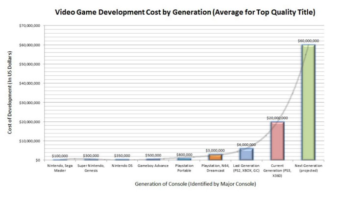

## "El coste de desarrollo de los videojuegos se ha incrementado exponencialmente en la última década."

Fua, que guapa queda la frase. Parece que la hubiera escrito un piriodista de verdad. Un juntaletras de esos que escriben en IGN.
Coñas aparte. Es verdad que a los estudios cada vez les cuesta más desarrollar sus juegos. Si quieren hacer jueguicos superacojonantes necesitan o mucho tiempo de desarrollo o mucho personal (o ambas).

Fuente: [Daniel Ahmad](https://twitter.com/ZhugeEX/status/917116648804507648)

El gráfico de arriba es de 2011, e intentó predecir que el coste de desarrollo para la actual generación sería de unos 60 millones. Como dice el propio Daniel Ahmad, [ya hemos pasado esa barrera con creces.](https://twitter.com/ZhugeEX/status/917116648804507648)
Y sin embargo, el precio de venta de un juego nuevo suele seguir rondando los 60€ o 60$. (Sabemos que no es así, Nintendo vende más barato y algunas compañías más caro, 65 o incluso 70€, pero bueno)

Entonces… ¿Qué hacen las grandes empresas para seguir ingresando todos sus millonetis y poder seguir creciendo para hacer más millonetis sin importar la calidad de sus títulos?
Suelen hacer dos cosas: trocear el juego y venderlo como DLC (el caso más sangrante fue EA con Star wars: Battlefront) o meter lootboxes y microtransacciones como si fuera un free to play (el último caso más sangrante: Star wars Battlefront II).
Por supuesto EA no es la única compañía que hace esto. Shadow of war ha introducido lootboxes incluso en la campaña de un jugador. Destiny 2 también tiene micropagos por un tubo y 2K games hace lo propio con sus juegos de la NBA y el online de GTAV.

¿Y sabéis que?  

#Estoy hartísimo.

[EA cierra visceral](https://www.polygon.com/2017/10/17/16490960/ea-closing-visceral-games-star-wars-game-delayed) por hacer un juego de Star wars que no estaba enfocado a ser un Game as a service y Activision patenta un [sistema de matchmaking](https://www.ign.com/articles/2017/10/17/activision-files-patent-for-microtransaction-minded-matchmaking-system) para hacer los jugadores compren más objetos in-game.

Todo esto sería pasable si los juegos fueran gratis o los elementos por los que pagas no afectasen en absoluto al gameplay (como en Overwatch). Pero si lo que haces es venderme un [Pay to win por 60€ como SW: Battlefront II](https://www.eurogamer.net/articles/2017-06-30-star-wars-battlefront-2-loot-boxes-spark-pay-to-win-fears), no voy a molestarme ni en hablar de ello a mis amigos.
Lo mejor de todo esto, es que las cosas se puede hacer bien si la compañía quiere. Ya he puesto el ejemplo de Overwatch, cuyas lootboxes son exclusivamente estéticas. The Witcher 3 es otro buen ejemplo, donde las expansiones están tan repletas de contenido como hace 20 años.

Mirad, no tengo ni puta idea de administración de empresas ni de como hacer rentable una. Lo que sí tengo claro es que lo se está haciendo ahora mismo son malas prácticas contra el consumidor/jugador. Y no voy a permitir que eso se siga llevando acabo con mi dinero. Os recomiendo que hagáis lo mismo, pues lo que mejor entienden las compañías es cuando entra poco dinero en sus carteras.

Y sin embargo, creo que es la dirección que por desgracia va a tomar gran parte de la industria AAA, pues parece que hay una gran mayoría que simplemente les da igual y pasan por el aro.
#Pues yo ya no paso más. Podéis meteros vuestro dinero por donde os quepa, el mío no le vais a ver nunca más.